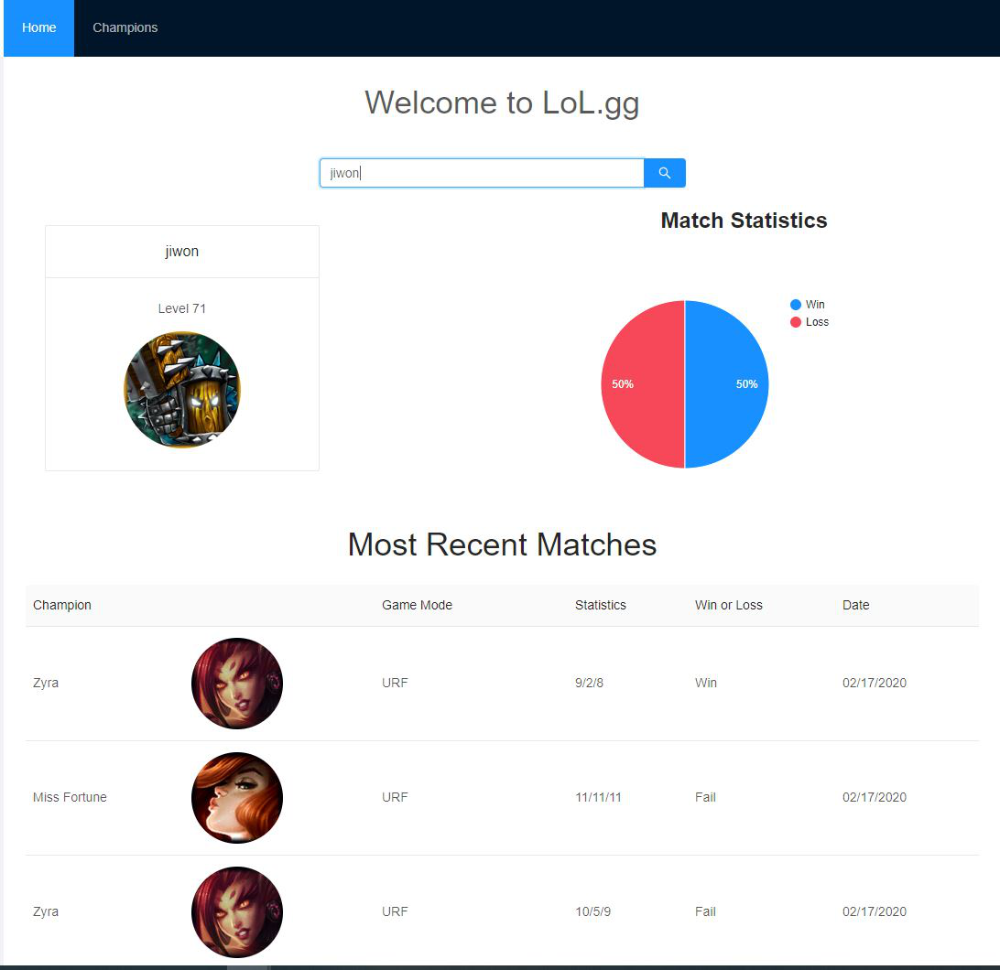
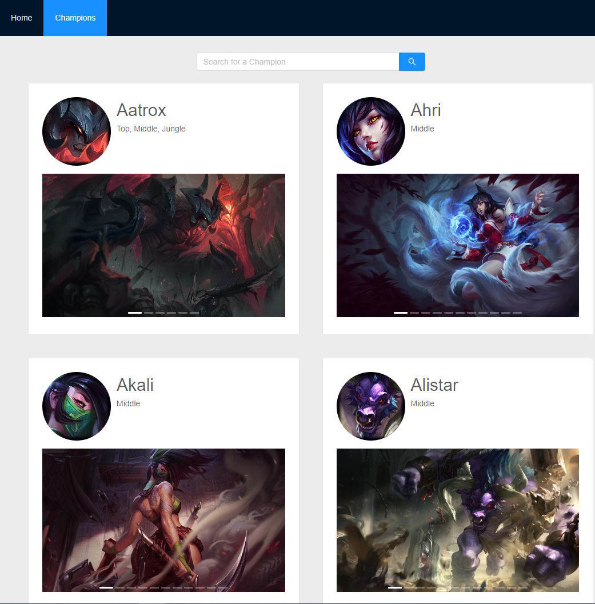
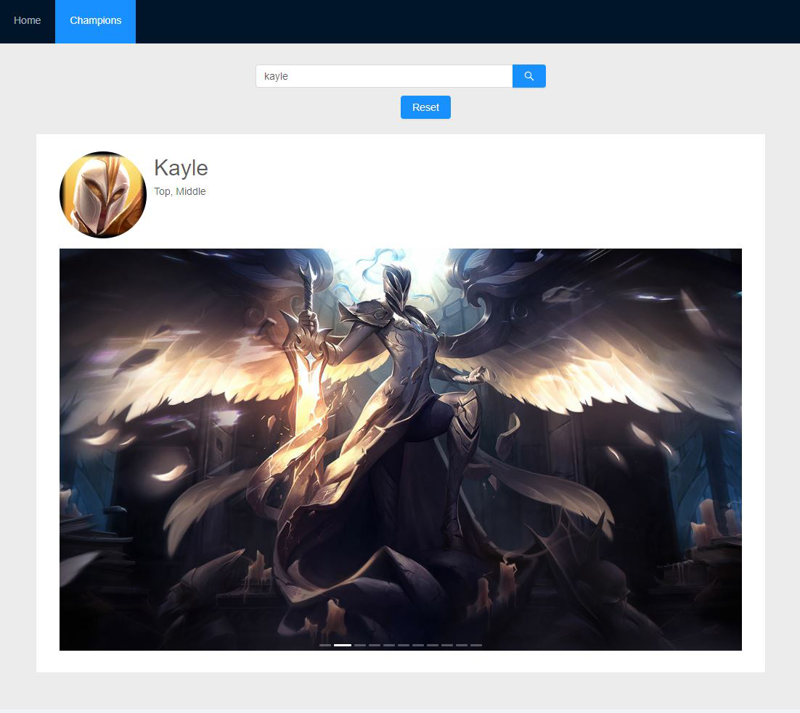

# Lol.ggv2

## Description:

Lol.ggv2 is a webs application to lookup the most recent match histories. Given a summoner's username, the website will display summoner's level, profile icon, graph of win/loss ratio, champion's name, champion's icon, kill/death/assist statistics and date. The website also displays all of the champions League of Legends currently have, and will display avaialble skins in a carousel.

## Screenshots

## Technologies Used:

### Front End:

- React (Create-React-App)
- antDesign
- Axios
- Google-charts
- Moment

### Back End:

- Node.js
- Express
- Mongoose
- fetch
- League of Legends API

## Future Improvements:

- Imporve error handling on both on the server and the client and include alerts when errors do happen
- Include additional data and statistics from the API such as summoners used and other players in the game, and display the new data when the toggle is clicked.
- Develop and include authentication and a personal dashboard
- Include a loading icon inbetween when data is loading
- Develop a store using Redux for all of the React components have access to the state
- Make the website mobile responsive

## Difficulties:

- Working with the League of Legends' API was a challenge because of the nested API calls that had to be made, and great deal of the data were crypted by id. 
    - I learned about async await method to handle promises and avoid call back hell. In addition, async await method made error handling simpler by only checking if the first promise returned an error versus checking each of my API calls for errors.
